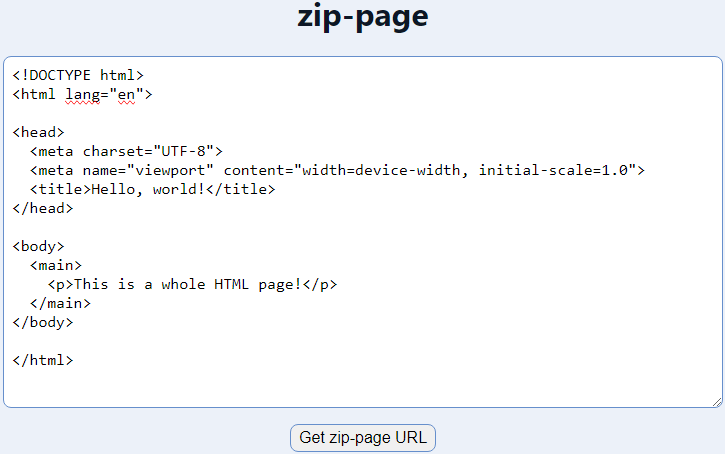

# zip-page

Minimal utility for zipping entire web pages into a URL.

Uses the [Compression Streams API](https://developer.mozilla.org/en-US/docs/Web/API/Compression_Streams_API) for `gzip`.

## Example usage

1. Copy the HTML for a web page you want to share:

```html
<!DOCTYPE html>
<html lang="en">

<head>
  <meta charset="UTF-8">
  <meta name="viewport" content="width=device-width, initial-scale=1.0">
  <title>Hello, world!</title>
</head>

<body>
  <main>
    <p>This is a whole HTML page!</p>
  </main>
</body>

</html>
```

2. Paste the entire HTML code into the text area:



3. Click "Get zip-page URL" to compress and encode the HTML into a URL:


4. Open the URL in any web browser to view your zip-page:


## Similar projects

- [Netlify Drop](https://app.netlify.com/drop)
- [Surge](https://surge.sh/)
- [Instant Preview](https://github.com/kjk/instaprev)
